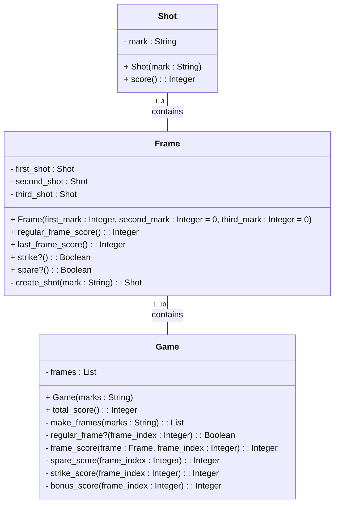

```mermaid
classDiagram
  class Shot {
    - mark : String
    + Shot(mark : String)
    + score() : Integer
  }
  class Frame {
    - first_shot : Shot
    - second_shot : Shot
    - third_shot : Shot
    + Frame(first_mark : Integer, second_mark : Integer = 0, third_mark : Integer = 0)
    + regular_frame_score() : Integer
    + last_frame_score() : Integer
    + strike?() : Boolean
    + spare?() : Boolean
    - create_shot(mark : String) : Shot
  }
  class Game {
    - frames : List<Frame>
    + Game(marks : String)
    + total_score() : Integer
    - make_frames(marks : String) : List<Frame>
    - regular_frame?(frame_index : Integer) : Boolean
    - frame_score(frame : Frame, frame_index : Integer) : Integer
    - spare_score(frame_index : Integer) : Integer
    - strike_score(frame_index : Integer) : Integer
    - bonus_score(frame_index : Integer) : Integer
  }

Shot "1..3" -- Frame : contains
Frame "1..10" -- Game : contains
```
