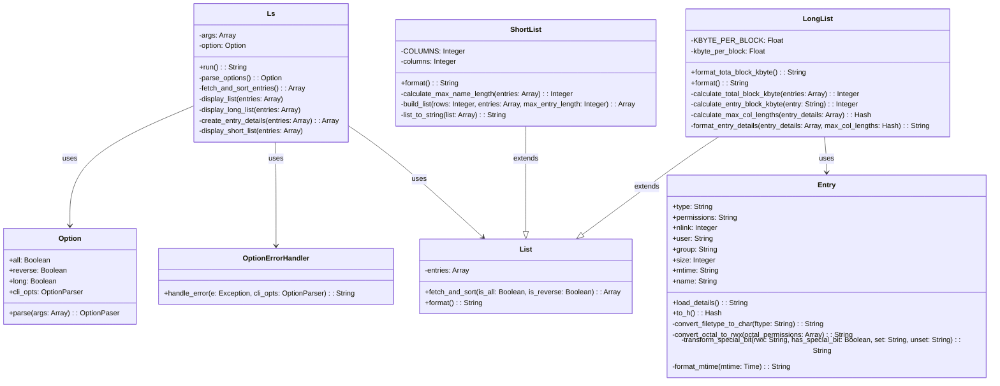

```mermaid
classDiagram
    class Ls {
        -args: Array
        -option: Option
        +run(): String
        -parse_options(): Option
        -fetch_and_sort_entries(): Array
        -display_list(entries: Array)
        -display_long_list(entries: Array)
        -create_entry_details(entries: Array): Array
        -display_short_list(entries: Array)
    }
    class Option {
        +all: Boolean
        +reverse: Boolean
        +long: Boolean
        +cli_opts: OptionParser
        +parse(args: Array): OptionPaser
    }
    class OptionErrorHandler {
        +handle_error(e: Exception, cli_opts: OptionParser): String
    }
    class List {
        -entries: Array
        +fetch_and_sort(is_all: Boolean, is_reverse: Boolean): Array
        +format(): String
    }
    class ShortList {
        -COLUMNS: Integer
        -columns: Integer
        +format(): String
        -calculate_max_name_length(entries: Array): Integer
        -build_list(rows: Integer, entries: Array, max_entry_length: Integer): Array
        -list_to_string(list: Array): String
    }
    class LongList {
        -KBYTE_PER_BLOCK: Float
        -kbyte_per_block: Float
        +format_tota_block_kbyte(): String
        +format(): String
        -calculate_total_block_kbyte(entries: Array): Integer
        -calculate_entry_block_kbyte(entry: String): Integer
        -calculate_max_col_lengths(entry_details: Array): Hash
        -format_entry_details(entry_details: Array, max_col_lengths: Hash): String
    }
    class Entry {
        +type: String
        +permissions: String
        +nlink: Integer
        +user: String
        +group: String
        +size: Integer
        +mtime: String
        +name: String
        +load_details(): String
        +to_h(): Hash
        -convert_filetype_to_char(ftype: String): String
        -convert_octal_to_rwx(octal_permissions: Array): String
        -transform_special_bit(rwx: String, has_special_bit: Boolean, set: String, unset: String): String
        -format_mtime(mtime: Time): String
    }
    Ls --> Option : uses
    Ls --> OptionErrorHandler : uses
    Ls --> List : uses
    ShortList --|> List : extends
    LongList --|> List : extends
    LongList --> Entry : uses
```
