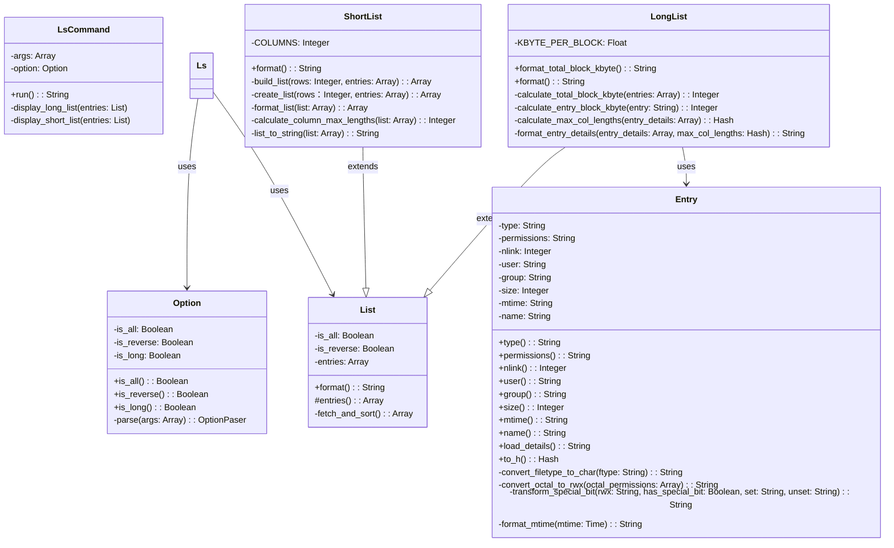

```mermaid
classDiagram
    class LsCommand {
        -args: Array
        -option: Option
        +run(): String
        -display_long_list(entries: List)
        -display_short_list(entries: List)
    }
    class Option {
        -is_all: Boolean
        -is_reverse: Boolean
        -is_long: Boolean
        +is_all(): Boolean
        +is_reverse(): Boolean
        +is_long(): Boolean
        -parse(args: Array): OptionPaser
    }
    class List {
        -is_all: Boolean
        -is_reverse: Boolean
        -entries: Array
        +format(): String
        #entries(): Array
        -fetch_and_sort(): Array
    }
    class ShortList {
        -COLUMNS: Integer
        +format(): String
        -build_list(rows: Integer, entries: Array): Array
        -create_list(rows：Integer, entries: Array): Array
        -format_list(list: Array): Array
        -calculate_column_max_lengths(list: Array): Integer
        -list_to_string(list: Array): String
    }
    class LongList {
        -KBYTE_PER_BLOCK: Float
        +format_total_block_kbyte(): String
        +format(): String
        -calculate_total_block_kbyte(entries: Array): Integer
        -calculate_entry_block_kbyte(entry: String): Integer
        -calculate_max_col_lengths(entry_details: Array): Hash
        -format_entry_details(entry_details: Array, max_col_lengths: Hash): String
    }
    class Entry {
        -type: String
        -permissions: String
        -nlink: Integer
        -user: String
        -group: String
        -size: Integer
        -mtime: String
        -name: String
        +type(): String
        +permissions(): String
        +nlink(): Integer
        +user(): String
        +group(): String
        +size(): Integer
        +mtime(): String
        +name(): String
        +load_details(): String
        +to_h(): Hash
        -convert_filetype_to_char(ftype: String): String
        -convert_octal_to_rwx(octal_permissions: Array): String
        -transform_special_bit(rwx: String, has_special_bit: Boolean, set: String, unset: String): String
        -format_mtime(mtime: Time): String
    }
    Ls --> Option : uses
    Ls --> List : uses
    ShortList --|> List : extends
    LongList --|> List : extends
    LongList --> Entry : uses
```
